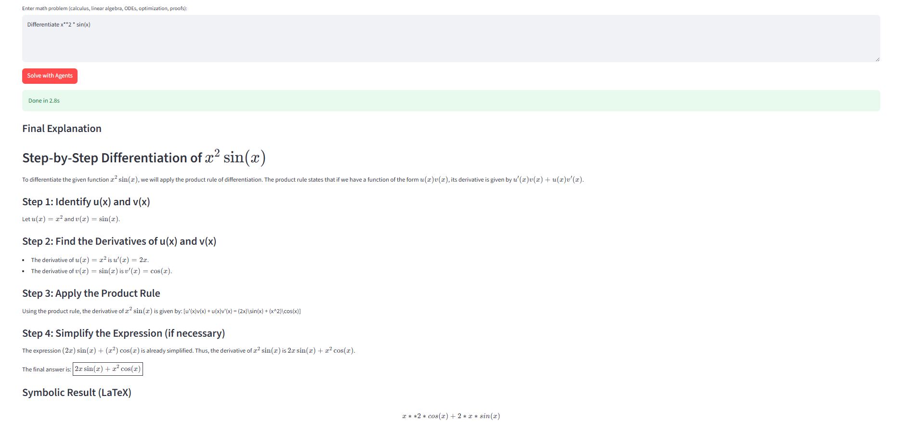
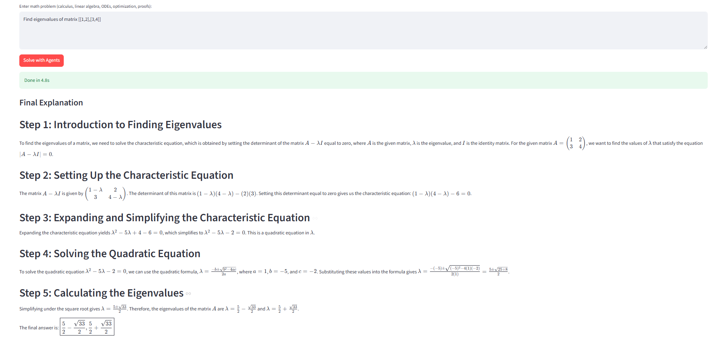

# MathAgent-X

**Autonomous Multi-Agent Mathematical Reasoning Engine**

LangGraph + Groq + SymPy system that solves natural-language university math problems (calculus, linear algebra, ODEs, optimization, basic proofs) with verified step-by-step solutions, self-critique loops, LaTeX export, and plots.

**Built by [Your Name] — Junior Mathematics Undergraduate at Saint Louis University (planning Masters in Math)**

Demonstrates advanced prompt engineering, multi-agent systems, and symbolic computation — exactly the skills clients pay for in AI automation and math tooling contracts.

### Features
- Multi-agent workflow: Planner → SymPy Solver → SciPy Verifier → Critic (self-refine) → Explainer
- ReAct + Tree-of-Thought + self-critique loops
- Symbolic + numerical verification
- Interactive Streamlit UI + LaTeX/PDF export + Matplotlib plots

### Tech Stack
- LangGraph (orchestration)
- Groq (Llama-3.3-70B)
- SymPy, SciPy, Matplotlib
- Streamlit

### Quick Start
```bash
streamlit run app.py
```

### Example Problems (tested)
* Differentiate x² sin(x)
* Solve y'' + y = 0
* Find eigenvalues of [[2,1],[1,2]]





### Client Use Cases
Education platforms, research labs, engineering firms — instant reliable math automation without hiring tutors or writing code.
Built as portfolio piece for Python + Prompt Engineering contracts.